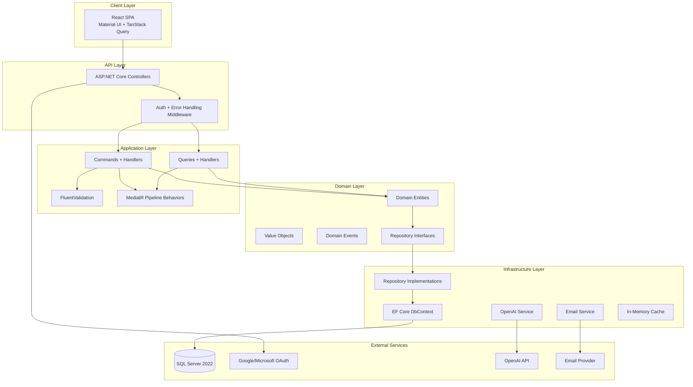
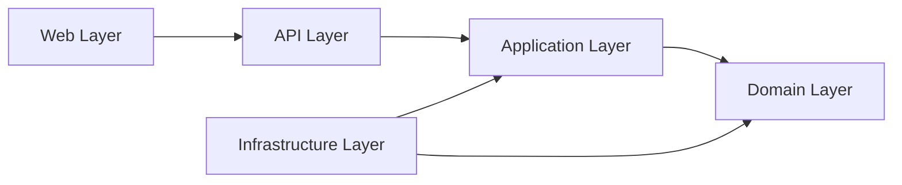
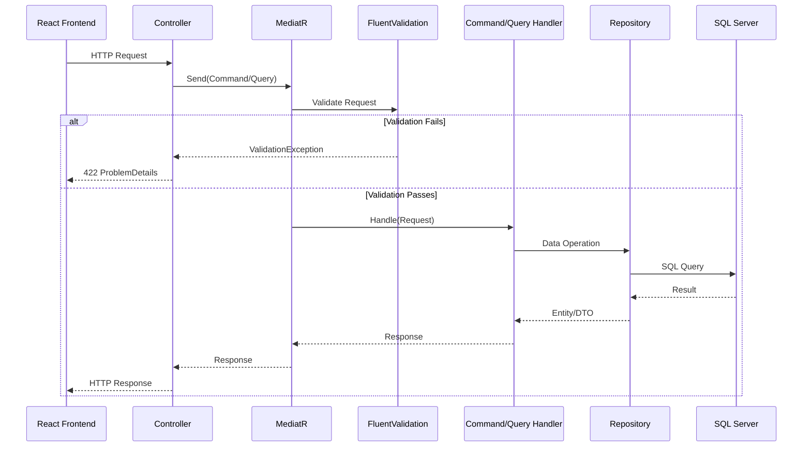
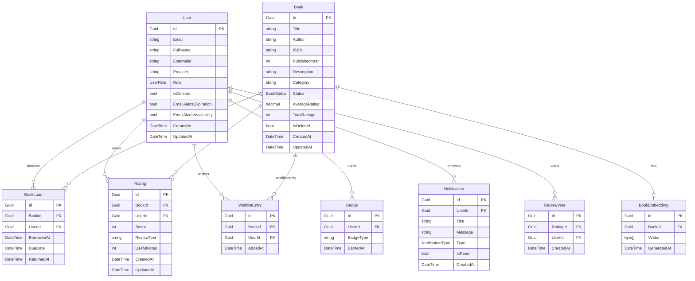

# Design Document: MiniLibrary System

## Overview

MiniLibrary is a full-featured library management system built on Clean Architecture principles. The system enables library staff to manage a book catalog, handle loan operations (check-in/check-out), and provides members with AI-powered search and recommendations. It supports three user roles (Admin, Librarian, Member) with SSO authentication via Google and Microsoft OAuth.

The system consists of an ASP.NET Core 8 Web API backend following CQRS patterns via MediatR, a React 18 SPA frontend with Material UI, and a SQL Server 2022 database. AI features leverage OpenAI API for semantic search (vector embeddings + cosine similarity) and personalized book recommendations.

Key design goals:
- **Separation of concerns** via Clean Architecture layers (Domain, Application, Infrastructure, API, Web)
- **Scalability** through pagination, caching, and async processing
- **Resilience** with graceful fallbacks when external services (OpenAI) are unavailable
- **Developer experience** with Docker Compose local development and CI/CD automation

## Architecture

### High-Level Architecture



### Clean Architecture Layer Dependencies



- **Domain**: Entities, value objects, domain events, repository interfaces. Zero external dependencies.
- **Application**: CQRS commands/queries, handlers, validators, DTOs, service interfaces. Depends only on Domain.
- **Infrastructure**: EF Core, OpenAI integration, email service, caching. Implements interfaces from Application/Domain.
- **API**: Controllers, middleware, DI configuration. Depends on Application.
- **Web**: React SPA. Communicates with API via HTTP/JSON.

### CQRS Flow



## Components and Interfaces

### Backend Components

#### API Layer (`MiniLibrary.API`)

| Component | Responsibility |
|-----------|---------------|
| `BooksController` | CRUD endpoints for book catalog management |
| `LoansController` | Check-in/check-out and loan history endpoints |
| `SearchController` | Text search and semantic search endpoints |
| `RecommendationsController` | AI-powered recommendation endpoint |
| `UsersController` | User management and profile endpoints |
| `AuthController` | OAuth authentication and token management |
| `DashboardController` | Statistics and metrics endpoints |
| `RatingsController` | Book ratings and reviews endpoints |
| `RankingsController` | Book and reader ranking endpoints |
| `WishlistController` | Wishlist and notification endpoints |
| `GamificationController` | Badges, achievements, and leaderboard endpoints |
| `AuthMiddleware` | JWT validation and role-based authorization |
| `ErrorHandlingMiddleware` | Global exception handling → ProblemDetails |
| `CorrelationIdMiddleware` | Generates X-Correlation-Id for request tracing |

#### Application Layer (`MiniLibrary.Application`)

| Component | Responsibility |
|-----------|---------------|
| `ValidationBehavior<TRequest, TResponse>` | MediatR pipeline behavior for FluentValidation |
| `LoggingBehavior<TRequest, TResponse>` | MediatR pipeline behavior for request/response logging |
| `Books/Commands/` | CreateBook, UpdateBook, DeleteBook handlers |
| `Books/Queries/` | GetBook, SearchBooks, SemanticSearch handlers |
| `Loans/Commands/` | CheckOutBook, CheckInBook handlers |
| `Loans/Queries/` | GetLoanHistory, GetOverdueLoans handlers |
| `Recommendations/Queries/` | GetRecommendations handler |
| `Users/Commands/` | AssignRole, UpdateNotificationPreferences handlers |
| `Users/Queries/` | GetUsers, GetUserProfile handlers |
| `Ratings/Commands/` | CreateRating, UpdateRating, DeleteRating, VoteReviewUseful handlers |
| `Ratings/Queries/` | GetBookRatings handler |
| `Rankings/Queries/` | GetBookRankings, GetReaderRankings, GetGamificationLeaderboard handlers |
| `Wishlist/Commands/` | AddToWishlist, RemoveFromWishlist handlers |
| `Notifications/Commands/` | MarkNotificationRead, SendAvailabilityAlert handlers |
| `Gamification/Commands/` | EvaluateBadges, AwardBadge handlers |
| `Dashboard/Queries/` | GetDashboardStats, GetLoanMetrics handlers |

#### Domain Layer (`MiniLibrary.Domain`)

| Component | Responsibility |
|-----------|---------------|
| `Book` | Aggregate root for book entity with status management |
| `BookLoan` | Entity tracking loan lifecycle |
| `User` | Aggregate root for user with role and preferences |
| `Rating` | Entity for book reviews and scores |
| `Wishlist` | Entity for member wish list entries |
| `Badge` | Entity for gamification achievements |
| `Notification` | Entity for in-app and email notifications |
| `Isbn` | Value object with ISBN-13 validation |
| `DateRange` | Value object for loan periods |
| `RelevanceScore` | Value object for semantic search scores (0.0–1.0) |
| `BookCreatedEvent` | Domain event for embedding generation |
| `BookReturnedEvent` | Domain event for badge evaluation and wishlist alerts |
| `BadgeEarnedEvent` | Domain event for notification generation |

**Key Interfaces (Domain/Application):**

```csharp
public interface IBookRepository
{
    Task<Book?> GetByIdAsync(Guid id, CancellationToken ct);
    Task<Book?> GetByIsbnAsync(string isbn, CancellationToken ct);
    Task<PagedResult<Book>> SearchAsync(SearchCriteria criteria, CancellationToken ct);
    Task AddAsync(Book book, CancellationToken ct);
    Task UpdateAsync(Book book, CancellationToken ct);
    Task DeleteAsync(Book book, CancellationToken ct);
}

public interface ILoanRepository
{
    Task<int> GetActiveLoanCountAsync(Guid userId, CancellationToken ct);
    Task<BookLoan?> GetActiveLoanAsync(Guid bookId, Guid userId, CancellationToken ct);
    Task<PagedResult<BookLoan>> GetUserHistoryAsync(Guid userId, PaginationParams paging, CancellationToken ct);
    Task<List<BookLoan>> GetOverdueLoansAsync(CancellationToken ct);
    Task AddAsync(BookLoan loan, CancellationToken ct);
}

public interface IEmbeddingService
{
    Task<float[]?> GenerateEmbeddingAsync(string text, CancellationToken ct);
    Task<List<SemanticResult>> SearchSimilarAsync(float[] queryEmbedding, int maxResults, float threshold, CancellationToken ct);
}

public interface IRecommendationService
{
    Task<List<RecommendationResult>> GetRecommendationsAsync(Guid userId, List<BookLoan> history, CancellationToken ct);
}

public interface INotificationService
{
    Task SendInAppAsync(Guid userId, string title, string message, CancellationToken ct);
    Task SendEmailAsync(string email, string subject, string htmlBody, CancellationToken ct);
}

public interface ICacheService
{
    Task<T?> GetAsync<T>(string key, CancellationToken ct);
    Task SetAsync<T>(string key, T value, TimeSpan expiration, CancellationToken ct);
    Task InvalidateAsync(string key, CancellationToken ct);
}
```

#### Infrastructure Layer (`MiniLibrary.Infrastructure`)

| Component | Responsibility |
|-----------|---------------|
| `AppDbContext` | EF Core DbContext with entity configurations |
| `BookRepository` | IBookRepository implementation with EF Core |
| `LoanRepository` | ILoanRepository implementation |
| `OpenAIEmbeddingService` | IEmbeddingService using OpenAI text-embedding-3-small |
| `OpenAIRecommendationService` | IRecommendationService using GPT-4o-mini |
| `SmtpNotificationService` | INotificationService via SMTP |
| `MemoryCacheService` | ICacheService using IMemoryCache |
| `BadgeEvaluationJob` | Background service for async badge evaluation |
| `LoanExpirationJob` | Daily batch job for loan expiration alerts |
| `MonthlyBadgeJob` | Monthly job for "Lector del Mes" badge |

### Frontend Components

#### Feature Modules

| Module | Components |
|--------|-----------|
| `features/auth/` | LoginPage, OAuthCallback, AuthContext |
| `features/books/` | BookList, BookDetail, BookForm, BookSearch |
| `features/loans/` | LoanHistory, CheckOutButton, CheckInButton |
| `features/search/` | SearchBar, SemanticSearchPage, SearchResults |
| `features/recommendations/` | RecommendationsList, RecommendationCard |
| `features/dashboard/` | DashboardPage, StatsCards, LoanCharts |
| `features/ratings/` | RatingForm, ReviewList, StarDisplay |
| `features/rankings/` | BookRankingPage, ReaderRankingPage |
| `features/wishlist/` | WishlistPage, WishlistButton, AvailabilityBadge |
| `features/gamification/` | BadgesPage, ProgressBar, LeaderboardPage |
| `features/notifications/` | NotificationBell, NotificationPanel |
| `features/users/` | UserManagement, RoleSelector |

#### Shared Infrastructure

| Component | Responsibility |
|-----------|---------------|
| `services/apiClient.ts` | Axios instance with auth interceptor and correlation ID |
| `hooks/usePagination.ts` | Shared pagination hook |
| `hooks/useOptimisticMutation.ts` | Optimistic update pattern for TanStack Query |
| `components/PagedList.tsx` | Generic paginated list with skeleton loading |
| `components/EmptyState.tsx` | Informative empty states with illustrations |
| `theme/` | Material UI custom theme (light/dark modes) |

## Data Models

### Entity Relationship Diagram



### Enumerations

```csharp
public enum BookStatus { Available, CheckedOut }
public enum UserRole { Admin, Librarian, Member }
public enum NotificationType { LoanExpiring, LoanOverdue, BookAvailable, BadgeEarned }
public enum BadgeType
{
    PrimerPrestamo, LectorNovato, LectorAvido, LectorExperto, Centenario,
    CriticoLiterario, VozDeLaComunidad, Explorador, Polimata,
    Puntual, LectorDelMes, TopReviewer
}
```

### Key DTOs

```csharp
// Standard paginated response wrapper
public record PagedResponse<T>(
    List<T> Data,
    PaginationMetadata Pagination);

public record PaginationMetadata(
    int TotalCount,
    int PageSize,
    int CurrentPage,
    int TotalPages,
    bool HasNext,
    bool HasPrevious);

// Book DTOs
public record BookResponse(
    Guid Id, string Title, string Author, string Isbn,
    int PublishedYear, string Description, string Category,
    string Status, decimal AverageRating, int TotalRatings,
    List<ReviewSummary> RecentReviews);

public record CreateBookRequest(
    string Title, string Author, string Isbn,
    int PublishedYear, string Description, string Category);

// Loan DTOs
public record LoanResponse(
    Guid Id, Guid BookId, string BookTitle,
    DateTime BorrowedAt, DateTime DueDate, DateTime? ReturnedAt);

// Search DTOs
public record SemanticSearchResponse(
    Guid BookId, string Title, string Author,
    string Category, decimal RelevanceScore, bool UsedFallback);

// Recommendation DTO
public record RecommendationResponse(
    Guid BookId, string Title, string Author,
    string Category, string Justification);
```

### Database Indexes

| Table | Index | Purpose |
|-------|-------|---------|
| Books | IX_Books_ISBN (unique) | ISBN uniqueness constraint |
| Books | IX_Books_Status | Filter by availability |
| Books | IX_Books_Category | Category filtering |
| Books | IX_Books_Title_Author | Text search optimization |
| BookLoans | IX_BookLoans_UserId_ReturnedAt | User loan history queries |
| BookLoans | IX_BookLoans_BookId_ReturnedAt | Active loan lookup |
| BookLoans | IX_BookLoans_DueDate | Overdue detection |
| Ratings | IX_Ratings_BookId | Book rating queries |
| Ratings | IX_Ratings_UserId_BookId (unique) | One rating per user per book |
| WishlistEntries | IX_Wishlist_UserId | User wishlist queries |
| WishlistEntries | IX_Wishlist_BookId | Availability alert lookup |
| Badges | IX_Badges_UserId | User badges lookup |
| Notifications | IX_Notifications_UserId_IsRead | Unread notifications |


## Correctness Properties

*A property is a characteristic or behavior that should hold true across all valid executions of a system — essentially, a formal statement about what the system should do. Properties serve as the bridge between human-readable specifications and machine-verifiable correctness guarantees.*

### Property 1: Book Validation Rejects Invalid Data

*For any* book creation or update request where at least one field violates validation rules (title empty or > 255 chars, author empty or > 200 chars, ISBN not matching ISBN-13 format, year outside 1450–current year range, description > 2000 chars), the system SHALL reject the request and return validation errors for every invalid field.

**Validates: Requirements 1.5, 12.1, 12.3**

### Property 2: Book Deletion Invariant

*For any* book that has at least one active loan (unreturned BookLoan), a deletion request SHALL be rejected with HTTP 409, regardless of the requesting user's role.

**Validates: Requirements 1.4**

### Property 3: Check-Out Preconditions

*For any* check-out request, the operation SHALL succeed if and only if: (a) the book's status is Available AND (b) the requesting member has fewer than 5 active loans. If either condition is violated, the request SHALL be rejected with HTTP 409.

**Validates: Requirements 2.1, 2.3, 2.6**

### Property 4: Loan Creation Correctness

*For any* successful check-out operation, the resulting BookLoan SHALL have BorrowedAt equal to the current date, DueDate equal to BorrowedAt + 14 days, and the book's status SHALL transition to CheckedOut.

**Validates: Requirements 2.1**

### Property 5: Search Results Subset Correctness

*For any* text search query and filter combination, every book in the result set SHALL match the query string in at least one of: title, author, ISBN, or category (case-insensitive partial match), AND satisfy all applied filters (category, status, year range).

**Validates: Requirements 3.1, 3.3**

### Property 6: Semantic Search Result Invariants

*For any* semantic search result set, all returned books SHALL have a relevance score >= 0.3, and the results SHALL be ordered by descending relevance score.

**Validates: Requirements 4.1, 4.7**

### Property 7: Recommendation Exclusion Invariant

*For any* recommendation list generated for a member, no recommended book SHALL appear in the member's completed loan history (returned books) or active loans (unreturned books).

**Validates: Requirements 5.5**

### Property 8: Role-Based Access Control

*For any* API request, if the requesting user's role does not have permission for the target endpoint/action, the system SHALL reject the request with HTTP 403. Specifically: Members cannot access book management (create/update/delete), user management, or dashboard endpoints; non-authenticated users receive HTTP 401.

**Validates: Requirements 1.9, 6.6, 7.5, 8.5, 16.2, 17.7, 20.9**

### Property 9: ISBN Uniqueness

*For any* book creation or update operation, if the provided ISBN already exists on a different book in the catalog, the operation SHALL be rejected with a validation error.

**Validates: Requirements 11.4, 1.5**

### Property 10: Pagination Metadata Consistency

*For any* paginated API response with totalCount T and pageSize S: totalPages SHALL equal ceil(T / S), currentPage SHALL be within [1, totalPages] (or 1 if T=0), hasNext SHALL be true iff currentPage < totalPages, and hasPrevious SHALL be true iff currentPage > 1.

**Validates: Requirements 13.3, 13.1, 13.2**

### Property 11: JSON Serialization Round-Trip

*For any* valid API response object, serializing to JSON (camelCase, ISO 8601 dates) and deserializing back SHALL produce an object equivalent to the original.

**Validates: Requirements 14.4, 14.1, 14.3**

### Property 12: Rating Average Correctness

*For any* book with N ratings (scores s1, s2, ..., sN), the stored AverageRating SHALL equal round(sum(si) / N, 1 decimal place), and TotalRatings SHALL equal N.

**Validates: Requirements 16.4, 16.1, 16.8**

### Property 13: Book Ranking Invariants

*For any* book ranking result set, all books SHALL have at least 3 ratings, and the list SHALL be ordered by the specified sort criterion (default: descending average rating).

**Validates: Requirements 17.1, 17.3**

### Property 14: Wishlist Size Limit

*For any* member, the total number of entries in their wishlist SHALL never exceed 20. Any addition attempt when at the limit SHALL be rejected with HTTP 409.

**Validates: Requirements 18.8**

### Property 15: Reader Ranking Ordering

*For any* reader ranking result set for a given period, members SHALL be ordered by descending count of returned loans within that period.

**Validates: Requirements 19.5**

### Property 16: Badge Criteria Evaluation

*For any* member whose activity history meets the criteria for a specific badge (e.g., 5 returned books for "Lector Novato"), the system SHALL award that badge exactly once.

**Validates: Requirements 20.1, 20.2**


## Error Handling

### Strategy

The system adopts a layered error handling approach:

1. **Validation Errors (422)**: Caught by MediatR `ValidationBehavior` pipeline before reaching handlers. FluentValidation produces structured field-level errors returned as RFC 7807 ProblemDetails.
2. **Business Rule Violations (409/403)**: Thrown as typed domain exceptions (`BookNotAvailableException`, `LoanLimitReachedException`, `InsufficientPermissionsException`) and mapped to appropriate HTTP codes by `ErrorHandlingMiddleware`.
3. **Not Found (404)**: Repository returns null, handler throws `NotFoundException`, middleware maps to 404.
4. **External Service Failures**: OpenAI timeouts/errors trigger fallback logic (text search for semantic, popular books for recommendations). Failures are logged but don't propagate to the client as 500s.
5. **Unhandled Exceptions (500)**: Caught by global middleware, logged with correlation ID, and returned as generic ProblemDetails with the correlation ID for debugging.

### Error Response Format (RFC 7807)

```json
{
  "type": "https://tools.ietf.org/html/rfc7807",
  "title": "Validation Error",
  "status": 422,
  "detail": "One or more validation errors occurred.",
  "instance": "/api/books",
  "errors": {
    "title": ["Title is required and must not exceed 255 characters."],
    "isbn": ["ISBN must be a valid 13-digit ISBN-13 format."]
  },
  "correlationId": "abc-123-def-456"
}
```

### Concurrency Handling

For the concurrent check-out scenario (Requirement 11.5), the system uses optimistic concurrency with a `RowVersion` column on the Book entity. When two requests attempt to check out the same book simultaneously:
1. Both read the book with status Available
2. First request updates status to CheckedOut and succeeds
3. Second request attempts update, EF Core detects version mismatch, throws `DbUpdateConcurrencyException`
4. Middleware catches and returns HTTP 409

### External Service Resilience

| Service | Timeout | Fallback |
|---------|---------|----------|
| OpenAI Embedding (search) | 3 seconds | Text-based search with `usedFallback: true` |
| OpenAI Recommendation | 10 seconds | Popular books by category from loan history |
| Email (SMTP) | 5 seconds | Log failure, retry via background job |

### Correlation ID Flow

Every request receives an `X-Correlation-Id` header (generated by middleware if not present). This ID is:
- Included in all log entries for the request
- Returned in all HTTP responses (success and error)
- Stored with any error logs for traceability

## Testing Strategy

### Dual Testing Approach

The project uses both unit tests and property-based tests for comprehensive coverage:

| Test Type | Tool | Purpose |
|-----------|------|---------|
| Unit Tests | xUnit + Moq + FluentAssertions | Specific examples, integration points, edge cases |
| Property Tests | xUnit + FsCheck | Universal properties across all valid inputs (100+ iterations) |
| Integration Tests | xUnit + TestContainers | End-to-end API testing with real SQL Server |
| Visual Regression | Playwright | Frontend rendering across viewports |

### Property-Based Testing (FsCheck)

Each correctness property from the design document maps to a property-based test with minimum 100 iterations. Tests are tagged with:

```csharp
// Feature: mini-library-system, Property 3: Check-Out Preconditions
[Property(MaxTest = 100)]
public Property CheckOut_Succeeds_OnlyWhenPreconditionsMet()
{
    // Generator produces random (book status, active loan count) pairs
    // Property verifies check-out succeeds iff Available AND count < 5
}
```

**Property test focus areas:**
- Validation logic (Property 1): Generate random invalid field combinations
- Business rules (Properties 2–4, 7–9, 14, 16): Generate random domain states
- Search correctness (Properties 5–6): Generate random catalogs and queries
- Data integrity (Properties 10–12): Generate random data sets and verify invariants
- Ordering (Properties 13, 15): Generate random scored/counted items and verify sort

### Unit Test Focus

Unit tests complement properties by covering:
- Specific happy-path examples (e.g., create a book with exact known data)
- Edge cases (empty collections, boundary values like exactly 5 loans)
- Integration between handlers and validators
- Fallback paths (OpenAI timeout → fallback search)
- Domain event dispatching (book returned → badge evaluation triggered)

### Integration Test Focus

Integration tests verify end-to-end flows with a real SQL Server container:
- Full authentication flow (OAuth mock → JWT → authorized request)
- Concurrent check-out scenario (verify only one succeeds)
- Pagination with real data sets
- Soft-delete behavior (deleted records excluded from queries)
- EF Core migration correctness

### Frontend Testing

| Type | Tool | Scope |
|------|------|-------|
| Component tests | Vitest + React Testing Library | Individual component behavior |
| Hook tests | Vitest + renderHook | Custom hook logic |
| E2E tests | Playwright | Critical user journeys |
| Visual regression | Playwright screenshots | 5 viewport breakpoints |
| Accessibility | axe-core + Lighthouse | WCAG 2.1 AA compliance |

### Test Organization

```
tests/
├── MiniLibrary.UnitTests/
│   ├── Books/
│   │   ├── CreateBookCommandValidatorTests.cs
│   │   ├── CheckOutBookHandlerTests.cs
│   │   └── BookSearchQueryHandlerTests.cs
│   ├── Loans/
│   ├── Ratings/
│   ├── Properties/         ← FsCheck property-based tests
│   │   ├── BookValidationProperties.cs
│   │   ├── LoanPreconditionProperties.cs
│   │   ├── SearchCorrectnessProperties.cs
│   │   ├── PaginationProperties.cs
│   │   ├── SerializationRoundTripProperties.cs
│   │   ├── RatingAverageProperties.cs
│   │   ├── RankingOrderProperties.cs
│   │   └── BadgeCriteriaProperties.cs
│   └── Generators/         ← FsCheck custom generators
│       ├── BookGenerator.cs
│       ├── LoanGenerator.cs
│       └── RatingGenerator.cs
├── MiniLibrary.IntegrationTests/
│   ├── BooksEndpointTests.cs
│   ├── LoansEndpointTests.cs
│   ├── ConcurrencyTests.cs
│   └── AuthorizationTests.cs
└── MiniLibrary.Web.Tests/
    ├── components/
    ├── hooks/
    └── e2e/
```

### CI Integration

- All property-based tests run as part of the CI pipeline (`dotnet test`)
- FsCheck configured with `MaxTest = 100` and deterministic seed for reproducibility
- Failed property tests output the shrunk counterexample for debugging
- Integration tests use TestContainers to spin up SQL Server in CI

