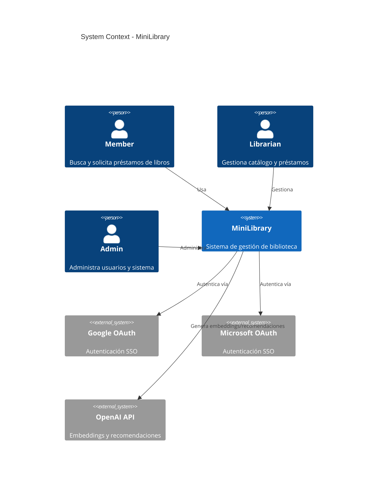

# Architecture Diagrams Guide

## Herramienta
- **Formato fuente**: Mermaid (`.mmd` o bloques en `.md`)
- **Rendering**: MCP mermaid-mcp-server (genera PNG/SVG)
- **Ubicación**: `docs/architecture/`

## Diagramas requeridos

| Diagrama | Archivo | Descripción |
|----------|---------|-------------|
| C4 Context | `c4-context.md` | Sistema y actores externos |
| C4 Container | `c4-container.md` | API, Frontend, DB, servicios externos |
| C4 Component (API) | `c4-component-api.md` | Capas internas del backend |
| ER Diagram | `er-diagram.md` | Modelo de datos (entidades principales) |
| Sequence - Auth | `seq-auth-flow.md` | Flujo de autenticación OAuth |
| Sequence - Checkout | `seq-checkout.md` | Flujo de préstamo de libro |

## Convenciones Mermaid

### Naming de archivos
- Prefijo por tipo: `c4-`, `seq-`, `flow-`, `er-`, `class-`
- Kebab-case: `seq-checkout-flow.md`

### Estructura de archivo
```markdown
# Título del Diagrama

## Descripción
Breve explicación de qué muestra el diagrama.

## Diagrama

```mermaid
[código mermaid]
```

## Notas
Cualquier aclaración relevante.
```

### Generación de imágenes
Usar el MCP mermaid para generar PNG/SVG:
- Output folder: `docs/architecture/images/`
- Naming: mismo nombre que el .md pero con extensión .png/.svg
- Theme: `default` para documentación, `dark` para presentaciones

## Cuándo actualizar diagramas
- Al agregar una nueva entidad al dominio → actualizar ER
- Al agregar un nuevo servicio/componente → actualizar C4 Container/Component
- Al modificar un flujo crítico → actualizar o crear diagrama de secuencia
- Al agregar integración externa → actualizar C4 Context

## C4 Model en Mermaid

Ejemplo de C4 Context:

