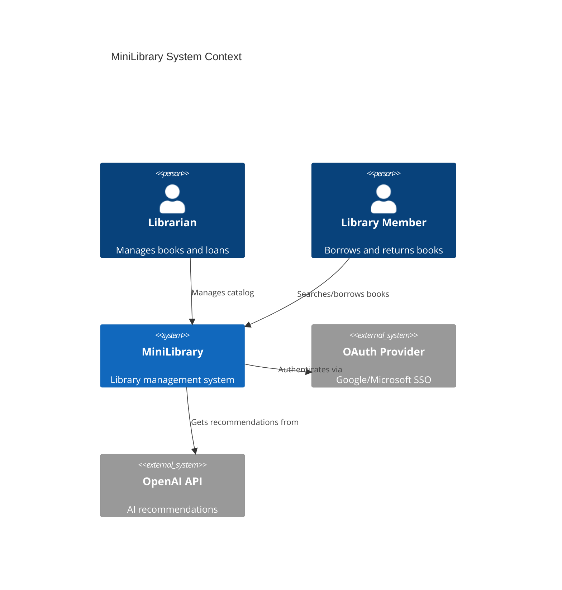
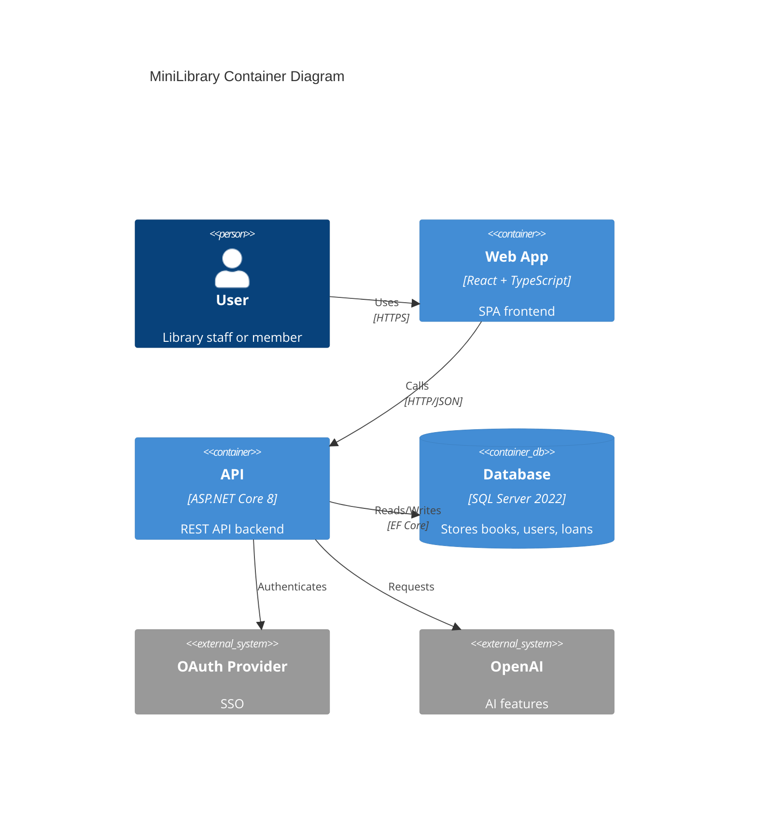
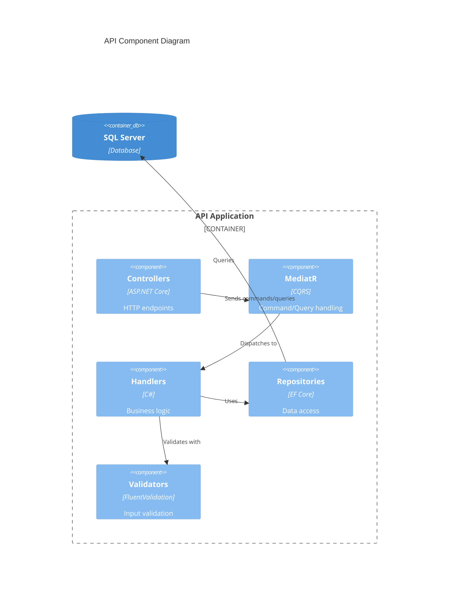
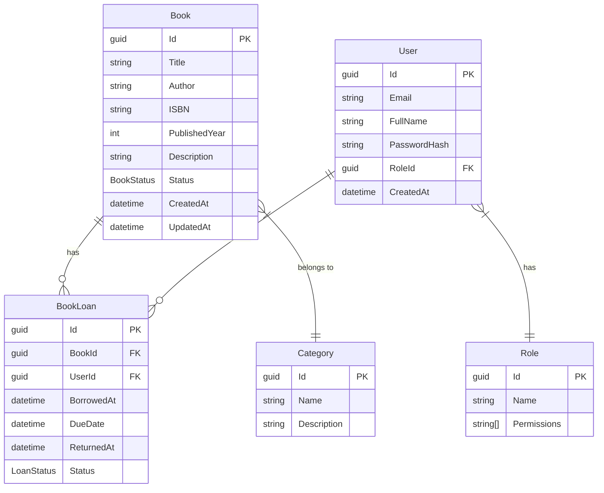

# Architecture Documentation

## C4 Model Diagrams

### System Context

### Container Diagram

### Component Diagram (API)

## Domain Model

## Technology Stack
| Layer | Technology | Purpose |
|-------|-----------|---------|
| Frontend | React 18 + TypeScript | SPA |
| UI Library | Material UI | Component library |
| State Mgmt | TanStack Query | Server state |
| Backend | ASP.NET Core 8 | REST API |
| CQRS | MediatR | Command/Query separation |
| ORM | EF Core 8 | Data access |
| Database | SQL Server 2022 | Persistence |
| Auth | ASP.NET Identity + OAuth | Authentication |
| AI | OpenAI API | Recommendations |
| Containers | Docker + Compose | Development & Deployment |
| CI/CD | GitHub Actions | Automation |
